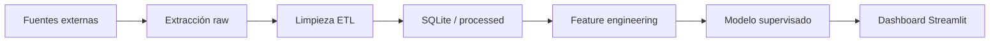

# PesoVision

**Predicción de la dirección del tipo de cambio USD/MXN** mediante extracción de conocimiento, ETL, modelado supervisado y dashboard interactivo.
---

## 1. Problema de negocio (Fase 1)

### ¿Qué queremos resolver?

Pequeñas y medianas empresas, importadores, exportadores y personas físicas en México toman decisiones diarias ligadas al tipo de cambio **USD/MXN** (comprar dólares, fijar precios, cubrir riesgo cambiario). Una herramienta que **anticipe si el peso subirá o bajará** frente al dólar en el corto plazo (1 día hábil) permite:

- Reducir incertidumbre en decisiones operativas.
- Complementar (no reemplazar) el criterio experto con señales basadas en datos históricos.
- Documentar un flujo reproducible: datos → limpieza → modelo → visualización.

### Pregunta analítica

> **¿Es posible predecir, con datos macroeconómicos y del mercado cambiario, si el tipo de cambio USD/MXN cerrará al alza o a la baja al día siguiente?**

### Variable objetivo (target)

| Definición | Valor |
|------------|-------|
| **Subida (1)** | `Close_t+1 > Close_t` |
| **Bajada (0)** | `Close_t+1 ≤ Close_t` |

(Fase 3 opcional): regresión del **retorno porcentual** `(Close_t+1 - Close_t) / Close_t`.

### Alcance y limitaciones

- Horizonte: **1 día hábil** (no trading intradía).
- No es asesoría financiera; es un proyecto educativo de ciencia de datos.
- El mercado cambiario tiene componente aleatoria; el objetivo es demostrar **metodología sólida**, no “ganarle al mercado”.

---

## 2. Justificación de herramientas (Fase 1)

| Herramienta | Uso en PesoVision | Justificación |
|-------------|-------------------|---------------|
| **Python 3.11+** | ETL, feature engineering, modelado, API del dashboard | Ecosistema maduro (`pandas`, `scikit-learn`, `yfinance`). Estándar en ciencia de datos. |
| **SQL (SQLite)** | Almacén local estructurado post-ETL | Separa capa analítica de archivos crudos; consultas reproducibles; cumple requisito de “almacén de datos”. |
| **pandas / NumPy** | Limpieza y transformación | Manipulación tabular eficiente, manejo de nulos y duplicados. |
| **scikit-learn** | Modelos supervisados y métricas | Regresión logística, árboles, validación cruzada, reportes estandarizados. |
| **Streamlit** | Dashboard interactivo (Fase 4) | Despliegue rápido en Python, filtros y gráficas sin stack web complejo. |
| **Plotly** | Gráficas interactivas | Series temporales, importancia de variables, matriz de confusión. |
| **yfinance / requests** | Extracción de datos | Acceso gratuito a USD/MXN y series complementarias. |

---

## 3. Fuentes de datos

| Fuente | Variables | Frecuencia | Rol |
|--------|-----------|------------|-----|
| **Yahoo Finance** (`USDMXN=X`) | Open, High, Low, Close, Volume | Diaria | Serie principal |
| **FRED** (opcional) | Tasa Fed, inflación US | Mensual/diaria | Contexto macro |
| **Banxico SIE** (opcional) | TIIE, reservas | Diaria | Contexto local |

Prioridad MVP: **solo USD/MXN + features técnicas derivadas** (medias móviles, volatilidad, retornos lag). Las series macro se agregan si el equipo tiene tiempo.

---

## 4. Arquitectura del proyecto

```
PesoVision/
├── data/
│   ├── raw/           # CSV/JSON sin transformar
│   ├── processed/     # Parquet/CSV listos para modelar
│   └── pesovision.db  # SQLite (post-ETL)
├── src/
│   ├── etl/           # Extracción, limpieza, carga (+ features en transform.py)
│   ├── models/        # common.py, train.py, evaluate.py
│   └── dashboard/     # Streamlit app (4 pestañas)
├── models/            # Artefactos del modelo (pkl, json, csv)
├── notebooks/         # EDA (01_eda.ipynb)
├── docs/
│   └── DOCUMENTO_FUNCIONALIDAD.md
├── tests/             # pytest
├── requirements.txt
└── README.md
```

### Flujo de datos



---

## 5. Estado del proyecto

### Resumen por fase

| Fase | Entregable | Estado |
|------|------------|--------|
| **1** | Contexto, problemática y justificación de herramientas | Completa |
| **2** | ETL + SQLite + EDA | Completa |
| **3** | Modelo + evaluación + artefactos | Completa |
| **4** | Dashboard Streamlit (4 pestañas) | Completa |

### Componentes implementados

**ETL:** `extract.py`, `transform.py`, `load.py`, `run_etl.py`

**Modelado:** `common.py`, `train.py`, `evaluate.py` — Regresión Logística vs Random Forest, split temporal, métricas train/test

**Dashboard:** pestañas **Predicción del día**, **Serie USD/MXN**, **Métricas del clasificador** y **Datos y ETL**

**EDA:** [`notebooks/01_eda.ipynb`](notebooks/01_eda.ipynb)

**Tests:** [`tests/`](tests/) con pytest (7 tests)

### Artefactos generados (`models/`)

| Archivo | Descripción |
|---------|-------------|
| `best_model.pkl` | Modelo ganador + features |
| `all_models.pkl` | Ambos modelos entrenados |
| `metrics.json` | Métricas train/test, CV F1, importancia |
| `test_predictions.csv` | Predicciones del periodo test |
| `roc_curve.json` | Puntos FPR/TPR para gráfica ROC |

### Nota técnica: generalización del modelo

Tras entrenar, revisar `metrics.json`: comparar F1 train vs test. Un gap grande (train >> test) sugiere overfitting; F1 test ~0.5 indica señal débil (esperable en FX diario). El dashboard incluye un resumen automático en la pestaña **Modelo**.

---

## 6. Cómo ejecutar (desarrollo)

```bash
# Entorno virtual
python -m venv .venv
.venv\Scripts\activate          # Windows
pip install -r requirements.txt

# Fase 2: ETL
python -m src.etl.run_etl

# Fase 3: Entrenar y evaluar modelo
python -m src.models.train

# Re-evaluar sin reentrenar (requiere all_models.pkl)
python -m src.models.evaluate

# Tests
pytest tests/ -q

# Fase 4: Dashboard
streamlit run src/dashboard/app.py
```

Si ya existen `data/pesovision.db` y `models/best_model.pkl`, basta con activar el entorno y ejecutar el dashboard.

### Verificación completa

```powershell
python -m src.etl.run_etl
python -m src.models.train
pytest tests/ -q
streamlit run src/dashboard/app.py
```

---

## 7. Métricas de éxito (rúbrica)

- **ETL (20 pts):** datos sin nulos críticos, duplicados eliminados, justificación de fuentes, SQLite documentado.
- **Modelo (30 pts):** clasificador supervisado justificado, train/test temporal, reporte de precisión/recall/F1, comparación de al menos 2 algoritmos.
- **Dashboard (20 pts):** gráficas claras (serie, predicciones vs real, importancia de features), texto de interpretación para decisiones.
  
---

## Licencia y uso

Proyecto académico. No usar predicciones como recomendación de inversión.
