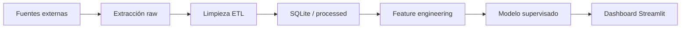

# PesoVision

**Predicción de la dirección del tipo de cambio USD/MXN** mediante extracción de conocimiento, ETL, modelado supervisado y dashboard interactivo.

> Proyecto académico · Equipo de 2 personas · Python + SQL + Streamlit

---

## 1. Problema de negocio (Fase 1)

### ¿Qué queremos resolver?

Pequeñas y medianas empresas, importadores, exportadores y personas físicas en México toman decisiones diarias ligadas al tipo de cambio **USD/MXN** (comprar dólares, fijar precios, cubrir riesgo cambiario). Una herramienta que **anticipe si el peso subirá o bajará** frente al dólar en el corto plazo (1 día hábil) permite:

- Reducir incertidumbre en decisiones operativas.
- Complementar (no reemplazar) el criterio experto con señales basadas en datos históricos.
- Documentar un flujo reproducible: datos → limpieza → modelo → visualización.

### Pregunta analítica

> **¿Es posible predecir, con datos macroeconómicos y del mercado cambiario, si el tipo de cambio USD/MXN cerrará al alza o a la baja al día siguiente?**

### Variable objetivo (target)

| Definición | Valor |
|------------|-------|
| **Subida (1)** | `Close_t+1 > Close_t` |
| **Bajada (0)** | `Close_t+1 ≤ Close_t` |

Alternativa avanzada (Fase 3 opcional): regresión del **retorno porcentual** `(Close_t+1 - Close_t) / Close_t`.

### Alcance y limitaciones

- Horizonte: **1 día hábil** (no trading intradía).
- No es asesoría financiera; es un proyecto educativo de ciencia de datos.
- El mercado cambiario tiene componente aleatoria; el objetivo es demostrar **metodología sólida**, no “batir al mercado”.

---

## 2. Justificación de herramientas (Fase 1)

| Herramienta | Uso en PesoVision | Justificación |
|-------------|-------------------|---------------|
| **Python 3.11+** | ETL, feature engineering, modelado, API del dashboard | Ecosistema maduro (`pandas`, `scikit-learn`, `yfinance`). Estándar en ciencia de datos. |
| **SQL (SQLite)** | Almacén local estructurado post-ETL | Separa capa analítica de archivos crudos; consultas reproducibles; cumple requisito de “almacén de datos”. |
| **pandas / NumPy** | Limpieza y transformación | Manipulación tabular eficiente, manejo de nulos y duplicados. |
| **scikit-learn** | Modelos supervisados y métricas | Regresión logística, árboles, validación cruzada, reportes estandarizados. |
| **Streamlit** | Dashboard interactivo (Fase 4) | Despliegue rápido en Python, filtros y gráficas sin stack web complejo. |
| **Plotly** | Gráficas interactivas | Series temporales, importancia de variables, matriz de confusión. |
| **yfinance / requests** | Extracción de datos | Acceso gratuito a USD/MXN y series complementarias. |

---

## 3. Fuentes de datos

| Fuente | Variables | Frecuencia | Rol |
|--------|-----------|------------|-----|
| **Yahoo Finance** (`USDMXN=X`) | Open, High, Low, Close, Volume | Diaria | Serie principal |
| **FRED** (opcional) | Tasa Fed, inflación US | Mensual/diaria | Contexto macro |
| **Banxico SIE** (opcional) | TIIE, reservas | Diaria | Contexto local |

Prioridad MVP: **solo USD/MXN + features técnicas derivadas** (medias móviles, volatilidad, retornos lag). Las series macro se agregan si el equipo tiene tiempo.

---

## 4. Arquitectura del proyecto

```
PesoVision/
├── data/
│   ├── raw/           # CSV/JSON sin transformar
│   ├── processed/     # Parquet/CSV listos para modelar
│   └── pesovision.db  # SQLite (post-ETL)
├── src/
│   ├── etl/           # Extracción, limpieza, carga (+ features en transform.py)
│   ├── models/        # Entrenamiento (train.py)
│   └── dashboard/     # Streamlit app
├── models/            # Modelo entrenado (best_model.pkl)
├── notebooks/         # Exploración EDA (pendiente)
├── docs/
│   ├── PLANIFICACION.md
│   ├── FASE1_CONTEXTO_Y_SELECCION.md
│   └── DOCUMENTO_FUNCIONALIDAD.md
├── tests/             # Pendiente
├── requirements.txt
└── README.md
```

### Flujo de datos



---

## 5. Estado del proyecto

> Actualizado según el avance real del repositorio. Detalle de tareas en [`docs/PLANIFICACION.md`](docs/PLANIFICACION.md).

### Resumen por fase

| Fase | Entregable | Estado |
|------|------------|--------|
| **1** | Contexto, problemática y justificación de herramientas | Casi completa |
| **2** | ETL funcional + `pesovision.db` | Implementada; falta EDA |
| **3** | Modelo + métricas (accuracy, F1, ROC-AUC) | Código listo; falta informe |
| **4** | Dashboard Streamlit + interpretación | Esqueleto (~25 %) |

### Hecho

**Fase 1 — Contexto**
- [x] README con problemática, target binario y arquitectura
- [x] [`docs/PLANIFICACION.md`](docs/PLANIFICACION.md) y [`docs/FASE1_CONTEXTO_Y_SELECCION.md`](docs/FASE1_CONTEXTO_Y_SELECCION.md)
- [x] Stack justificado (Python, SQLite, scikit-learn, Streamlit)
- [x] Fuentes de datos identificadas (MVP: Yahoo Finance `USDMXN=X`)

**Fase 2 — ETL**
- [x] `src/etl/extract.py` — descarga OHLCV desde Yahoo Finance
- [x] `src/etl/transform.py` — limpieza (nulos, duplicados, outliers) + feature engineering
- [x] `src/etl/load.py` — carga en SQLite (`raw_fx_daily`, `fx_clean`, `fx_features`)
- [x] `src/etl/run_etl.py` — orquestador de un solo comando
- [x] Datos generados: `data/raw/usdmxn_raw.csv`, `data/processed/fx_features.csv`, `data/pesovision.db`
- [x] ~1 950 filas de features (desde 2019 hasta la última ejecución del ETL)

**Fase 3 — Modelado**
- [x] `src/models/train.py` — Regresión Logística vs Random Forest
- [x] Split temporal 80/20 y validación con `TimeSeriesSplit`
- [x] Métricas en consola: accuracy, F1, ROC-AUC, matriz de confusión
- [x] Modelo guardado en `models/best_model.pkl` (actualmente: regresión logística)

**Fase 4 — Dashboard**
- [x] `src/dashboard/app.py` — app Streamlit básica
- [x] Métricas de resumen (último cierre, cambio 1d) y gráfica histórica USD/MXN

**Documentación**
- [x] [`docs/DOCUMENTO_FUNCIONALIDAD.md`](docs/DOCUMENTO_FUNCIONALIDAD.md) — borrador para entrega académica

### Pendiente

**Fase 1**
- [ ] Validar con el profesor que la clasificación binaria diaria cumple el encuadre del curso
- [ ] Completar nombres, fechas e institución en documentos de Fase 1

**Fase 2**
- [ ] Notebook EDA (`notebooks/01_eda.ipynb`) con 3 gráficas y conclusiones de calidad
- [ ] Revisión cruzada / checklist de la rúbrica ETL

**Fase 3**
- [ ] Informe de resultados con métricas finales (markdown o sección en documento funcional)
- [ ] Completar [`docs/DOCUMENTO_FUNCIONALIDAD.md`](docs/DOCUMENTO_FUNCIONALIDAD.md) secciones 8–9 (tabla de métricas, conclusiones, variables relevantes)
- [ ] Discusión formal de overfitting/underfitting
- [ ] Script `evaluate.py` separado (opcional; hoy la evaluación está en `train.py`)

**Fase 4**
- [ ] Predicción “Sube / Baja” con probabilidad para el día siguiente
- [ ] Histórico con predicciones correctas e incorrectas marcadas
- [ ] Matriz de confusión, curva ROC e importancia de variables en el dashboard
- [ ] Filtros de rango de fechas e interpretación orientada a decisiones

**Entrega final**
- [ ] Carpeta `tests/` con pruebas básicas
- [ ] Exportar documento funcional a PDF/DOCX
- [ ] Presentación con demo en vivo (ETL + dashboard, 10–15 min)

---

## 6. Cómo ejecutar (desarrollo)

```bash
# Entorno virtual
python -m venv .venv
.venv\Scripts\activate          # Windows
pip install -r requirements.txt

# Fase 2: ETL
python -m src.etl.run_etl

# Fase 3: Entrenar modelo
python -m src.models.train

# Fase 4: Dashboard
streamlit run src/dashboard/app.py
```

Si ya existen `data/pesovision.db` y `models/best_model.pkl`, basta con activar el entorno y ejecutar el dashboard.

---

## 7. Métricas de éxito (rúbrica)

- **ETL (20 pts):** datos sin nulos críticos, duplicados eliminados, justificación de fuentes, SQLite documentado.
- **Modelo (30 pts):** clasificador supervisado justificado, train/test temporal, reporte de precisión/recall/F1, comparación de al menos 2 algoritmos.
- **Dashboard (20 pts):** gráficas claras (serie, predicciones vs real, importancia de features), texto de interpretación para decisiones.

---

## 8. Equipo

| Rol | Foco |
|-----|------|
| **Persona A** | ETL, SQL, calidad de datos, documentación técnica Fase 2 |
| **Persona B** | Modelado, evaluación, dashboard, presentación |

Ambos revisan README final y ensayo de presentación.

---

## Licencia y uso

Proyecto académico. No usar predicciones como recomendación de inversión.
